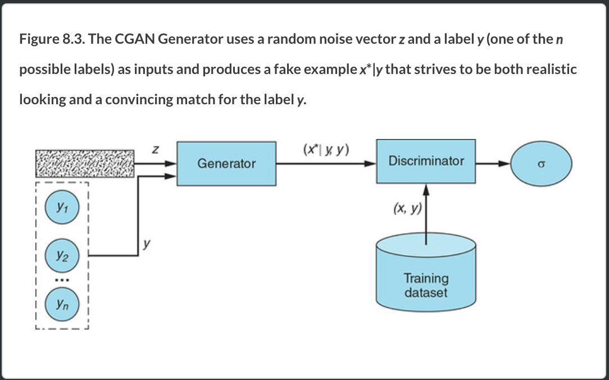
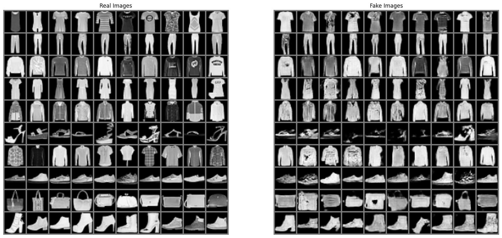
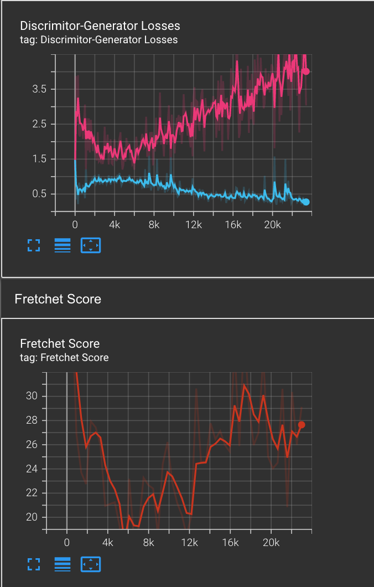

# Sensity ML Engineer Intern Position Assignment

Ali Akay
MSc. Student at University of Trento

In this assignment I trained Conditional DCGAN model for Fashion MNIST dataset.

## Conditional Generative Adversarial Nets

#### Authors
Mehdi Mirza, Simon Osindero

#### Abstract
Generative Adversarial Nets [8] were recently introduced as a novel way to train generative models. In this work we introduce the conditional version of generative adversarial nets, which can be constructed by simply feeding the data, y, we wish to condition on to both the generator and discriminator. We show that this model can generate MNIST digits conditioned on class labels. We also illustrate how this model could be used to learn a multi-modal model, and provide preliminary examples of an application to image tagging in which we demonstrate how this approach can generate descriptive tags which are not part of training labels.

[[Paper]](https://arxiv.org/pdf/1411.1784.pdf)

<p align="center"></p>

The CGAN is one of the first GAN innovations that made targeted data generation possible, and arguably the most influential one.

### Frechet Distance Evaluation Metric

FID is a more principled and comprehensive metric and has been shown to be more consistent with human evaluation in assessing the realism and variation of the generated samples.

###### The calculation can be divided into three parts:

1) use the Inception network to extract 2048-dimensional activations from the pool3 layer for real and generated samples respectively.
2) model the data distribution for these features using a multivariate Gaussian distribution with mean µ and covariance Σ. The calculate_activation_statistics() function does this.
3) Wasserstein-2 distance is calculated for the mean and covariance of real images(x) and generated images(g).

calculate_fretchet_distance() function does this.

Lower FID means better quality and diversity.

The implementation is from this github repo https://github.com/mseitzer/pytorch-fid

# Conditional DCGAN for Fashion MNIST Dataset with Frechet Distance Evaluation Metric

## Implementations

### Installation

First create an envirement for the project.It will download latest python version.

```bash
$ conda create --name sensity python=3.8
$ conda activate sensity

$ conda install pip

$ git clone https://github.com/aliakay/C-DCGAN-Fashion-MNIST.git
$ cd C-DCGAN-Fashion-MNIST
$ pip3 install -r requirements.txt
```

*If you have CUDA, please activate it in order to train from strach faster.Otherwise it use CPU.
```bash
python3 -m pip install torch==1.10.0+cu113 -f https://download.pytorch.org/whl/cu113/torch_stable.html
```

#### Training Results

First of all, I don't have GPU in my local computer so I used colab in order to train the networks.Then I I downloaded tensorboard logs and trained generator network and added to the folder to use in my local in order to create other functions.

You can check also my colab notebook.

[[Colab link]](https://colab.research.google.com/drive/1p-6nYoKUkfTGB2-PboHPPhQyuP5Ujlps?usp=sharing)

I already trained and save the generator model, so you can directly generate some example fake images of each category.

+ You can run this code and get the training results images.

```python
$ python3 train_evaluation.py --nz 100
```
Here is the result of training.

<p align="center"></p>

+ Check losses and generated images in tensorboard

```python
$ python3 -m tensorboard.main --logdir=logs
```
The standard GAN loss isn't useful in assessing whether training has converged or finished so I added Frechet Inception Distance and save the generator model based on it. Also every training I check generated images progress. 


#### Generate Sample

You can directly use pre-trained model that I trained and generator model is saved. You can try to generate sample images by commend line interface.

1) Run app.py
```python
$ python3 app.py
```
2) Choose one category 

+ Tshirt/top
+ Trouser
+ Pullover
+ Dress
+ Coat
+ Sandal
+ Shirt
+ Sneaker
+ Bag
+ Ankle boot

3) Open a new terminal and run the code
Example for dress

```python
$ curl -X GET "http://localhost:5000/?generate_sample=Sneaker"
```
It is going to give you a message that image is saved in the terminal where you run the curl code and It will save the image to Assest folder.

## Training from Strach

### Generator

Generator learns to produce realistic examples for each label in the training dataset

It takes random noise from latent space (nz=100) and maps it to an image distribution. These fake images along with the real images from Fashion MNIST dataset are fed into the discriminator and it outputs the probability of the image being fake or real.

I use ConvTranspose2d + stride for upsampling. Activations in every layer except the last layer is ReLU, I also tried leaky ReLU but I decided to use ReLU for generator in the end.

Batch Normalization stabilizes learning by normalizing the input to each unit to have zero mean and unit variance. This helps deal with training problems that arise due to poor initialization and helps the gradients flow in deeper models.

### Discriminator

Discriminator learns to distinguish fake example-label pairs from real example-label pairs.

Discriminator in a CGAN does not learn to identify which class is which. It learns only to accept real, matching pairs while rejecting pairs that are mismatched and pairs in which the example is fake.

It has leaky ReLU activations. Many activation functions will work fine with this basic GAN architecture. However, I used leaky ReLU because they help the gradients flow easier through the architecture.ALso LeakyRelu is similar to a rectifier, but instead of having all negative values become 0, there is a small negative slope. This layer allows the model to find nonlinearities
Finally, it needs to output probabilities. I use a Sigmoid Activation for that.

I use Conv2d + stride for downsampling.

Both the generator and discriminator are trained on Binary Cross Entropy Loss and Adam optimizer with same learning rates are used.

### Question: how easy/hard is this task for the Discriminator? 

First of all,using the loss values directly is not show us the model is easy or hard.Over time both the Discriminator and Generator losses should settle to a value, however it's somewhat difficult to tell whether they've converged on strong performance or whether they've converged due to something like mode collapse/diminishing gradients. So that it is also depends on Generator capability,if our Generator can able to generate good fake images, this could be make discriminator work hard.
I try to make stable and balance the network performance.In my model, It seems to discriminator outperform Generator.I could also use different Learning Rates in Generator and Discriminator.It could give some different results.
Secondly,I didn't add dropout in discriminator network for my first model but discriminator was overpowering the generator (D_loss was under 0.20 while G_loss over 3). so I decided to add dropout in order to reduce overfitting problem for this version of training but still discriminator loss was decreasing while generator was increasing.So I also added label smoothing and for the last model, I got more stable learning based on the loss.


### Evaluation and Loss

A GAN can be represented through the following loss function:

E_x[log (D(x))] + E_z[log (1 — D(G(z)))]

Here, generator try to minimize the loss function while the discriminator try to maximize the loss function. They play min-max game.

With a cGAN, we must consider also condition. This condition referred to as y. The modified Minimax loss function is represented as shown below:

E_x[log (D(x|y))] + E_z[log (1 — D(G(z|y)))]

Also,metrics such as the Inception Score, Frechet Inception Distance (FID score),and perceptual similarity measures (LPIPS) are used for interpreting the results. 
In inception score we measure quality of the image and their diversity. It means that generator should produce images with variety of recognizable classes. So we use an Inception network to classify the generated images and predict P(y|x) where y is the label and x is the generated data.Next, we need to measure diversity of the images.  If the generated images are diverse, the data distribution for y should be uniform (high entropy). 

But the disadvantage is that gan can memorize the training data which is overfitting but could still score well.

Frechet inception distance is we estimate divergence parametrically,we pass the Inception network to extract features from an intermediate layer. Then we model the data distribution for these features using a multivariate Gaussian distribution with mean µ and covariance Σ and compute franchet distance with real data. 

I implemented FID score and save the checkpoint with the model which has lowest score but when I only saved the model with lowest FID score,I realised that there are some good generator sample for the next epoch even FID score is not the lowest one. So I saved two model (generator model with lowest FID and generator model with last epoch) and decided to use model that I saved in last epoch.

+ You can see the results before label smoothing
<p align="center"></p>

+ Latest model with label smoothing Generator and Discriminator losses more stable and close each other so they could'nt fool each other.

### Training implementation

#### NOTE: If you start to run train.py,pre-trained generator model file will be replaced.So please run training first or test pre-trained model first.

You can train with different hyperparameters to the model.

```python
$ python3 train.py --batch_size 128 --num_epochs 50 --lr 0.0002 --nz 100 --ngf 32 --ndf 32 --nc 1 
```

After finish the training process check the losses and Real-Fake images on tensorboard

```python
$ python3 -m tensorboard.main --logdir=logs
```
